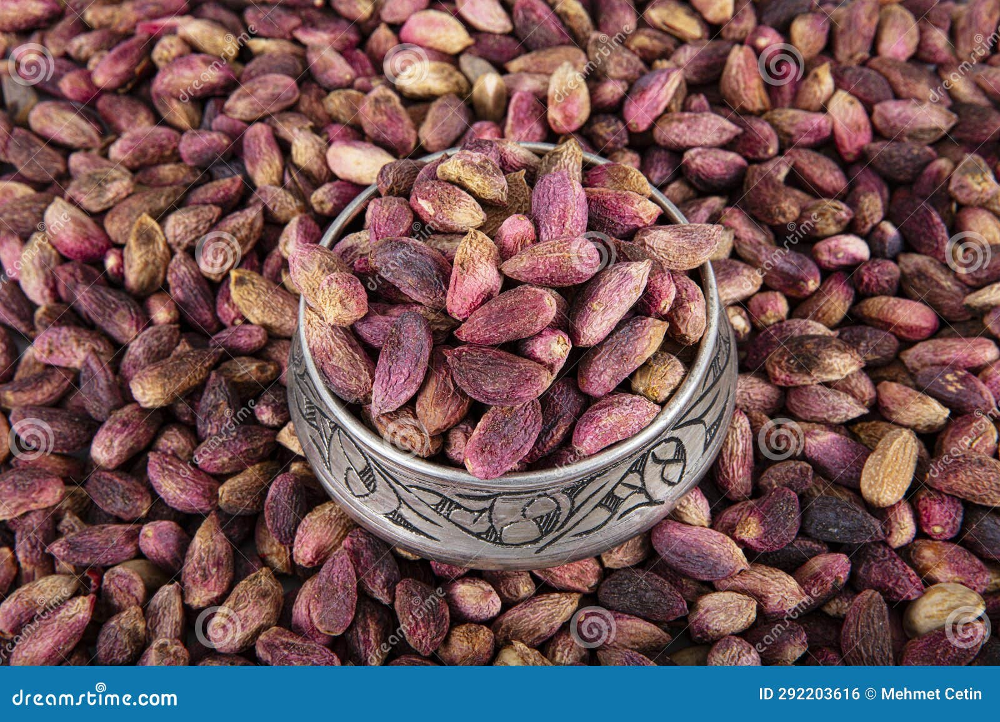

# Project Title: Pistachio Image Classifier


## Description
This project aims to classify images of pistachios into two types: Kirmizi (KP) and Siirt (SP). It uses Convolutional Neural Networks (CNNs) and additional feature data for accurate classification. This README provides an overview of the project, setup instructions, and usage details.

## Table of Contents
- [Installation](#installation)
- [Usage](#usage)
- [Data Description](#data-description)
- [Model Details](#model-details)
- [Visualization](#visualization)
- [Contributing](#contributing)
- [License](#license)

## Installation
To set up the project environment:

```bash
git clone https://github.com/your-github-username/pistachio-image-classifier.git](https://github.com/Tamaghnatech/Pistachios
cd pistachio-image-classifier
pip install -r requirements.txt
```

## Usage
To run the project:

```bash
python classifier.py
```

For visualizing CNN activations:

```bash
python visualize_cnn.py
```

## Data Description
The dataset consists of images of two types of pistachios:
- Kirmizi (KP)
- Siirt (SP)

Additionally, feature datasets are provided:
- KP features: `Pistachio_16_Features_Dataset.xls`
- SP features: `Pistachio_28_Features_Dataset.xls`

## Model Details
The project uses TensorFlow and Keras to build and train a CNN. The model includes layers like Conv2D, MaxPooling2D, Flatten, Dense, and Dropout.

## Visualization
The `visualize_cnn.py` script can be used to visualize the feature maps of the CNN layers to understand what features the model is learning.

## Contributing
Contributions to the project are welcome. Please follow these steps:

1. Fork the repository.
2. Create a new branch: `git checkout -b my-new-feature`.
3. Make your changes and commit them: `git commit -am 'Add some feature'`.
4. Push to the branch: `git push origin my-new-feature`.
5. Submit a pull request.

## License
[MIT License](LICENSE.txt) - see the `LICENSE` file for details.

